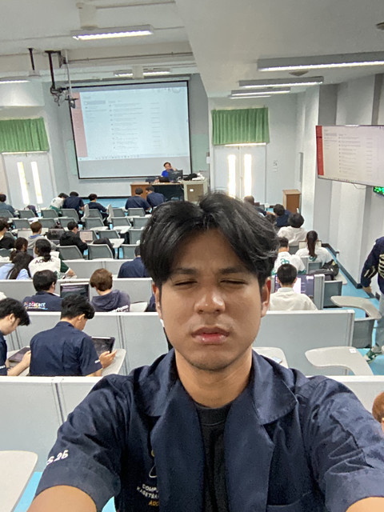

# Addeen Salaehsakul - Profile

## 💻 "อย่ากลัวความล้มเหลว เพราะตอนเดินสะดุด เราได้ขาข้างหนึ่งก้าวไปข้างหน้าแล้ว!"
  

---
### 🌿 About Me
- Passionate software developer transforming complex challenges into elegant solutions.
- Blending technology with creativity, crafting code that grows like a living ecosystem.
---
### 🔑 Work 1 : **Clearing (Keyword)**
- Learn about the comparison between **CISSP**, **NIST**, **ChatGPT**, and **Gemini** in more detail at [Click me to WORK](Clearing.md).
---
### 🎄 Work 2 : **Christmas E-card with Hidden Messages**
- Experience the magic of winter wonderland in my interactive Christmas E-card at [View Christmas Card (.html file)](Ecard2.html),
                                                                                   [View Christmas Card (.md file)](Ecard_cristmas.md)
- Features include:
  - Enchanting winter night theme with beautiful snowfall animation
  - Northern lights effect and interactive elements
  - **Steganography Implementation:**
    - Hidden messages embedded within the festive images
    - Secure message encoding using steganography techniques
    - Perfect blend of holiday cheer and cryptographic art
  - Downloadable special moments with secret messages
---

### 🌱 Connect With Me
  

---
### 📊 GitHub Stats

---
### 🌟 Quote
> "In the forest of code, every line is a seed of potential." - Addeen Salaehsakul
---
