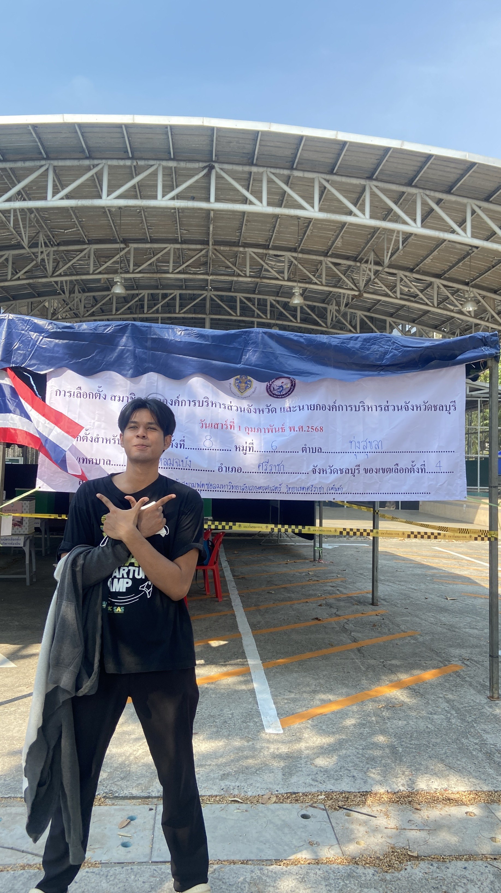

# สำรวจการเลือกตั้ง

## การเลือกตั้งสมาชิกสภาองค์การบริหารส่วนจังหวัด และนายกองค์การบริหารส่วนจังหวัดชลบุรี

📅 **วันเสาร์ที่ 1 กุมภาพันธ์ 2568**  
📍 **สถานที่เลือกตั้ง:** หน้าสนามฟุตซอลมหาวิทยาลัยเกษตรศาสตร์ ศรีราชา  

---

> บันทึกประสบการณ์การไปเซอร์เวย์การเลือกตั้งครั้งนี้ 🎉

### ความรู้สึกและสิ่งที่ได้จากการไปเซอร์เวย์

การได้ไปสังเกตการณ์เลือกตั้งครั้งนี้เป็นประสบการณ์ที่มีค่าอย่างมาก 🗳️ เราได้เห็นถึงกระบวนการเลือกตั้งที่โปร่งใส และการมีส่วนร่วมของประชาชนที่ออกมาใช้สิทธิ์ของตนเอง นอกจากนี้ยังได้พูดคุยกับเจ้าหน้าที่ประจำหน่วยเลือกตั้ง และเรียนรู้ถึงกระบวนการตรวจสอบและรักษาความเป็นธรรมในการเลือกตั้ง

สิ่งที่ได้จากการไปเซอร์เวย์:
- ตระหนักถึงความสำคัญของสิทธิในการเลือกตั้ง
- เรียนรู้เกี่ยวกับกระบวนการเลือกตั้งและการบริหารจัดการหน่วยเลือกตั้ง
- ได้เห็นความตั้งใจของประชาชนที่ออกมาใช้สิทธิ์ของตนเองอย่างเต็มที่
- ได้พูดคุยแลกเปลี่ยนความคิดเห็นกับผู้มีสิทธิเลือกตั้งและเจ้าหน้าที่

ถือเป็นประสบการณ์ที่มีคุณค่ามาก และทำให้เข้าใจถึงความสำคัญของประชาธิปไตยในระดับท้องถิ่นมากยิ่งขึ้น ✨
