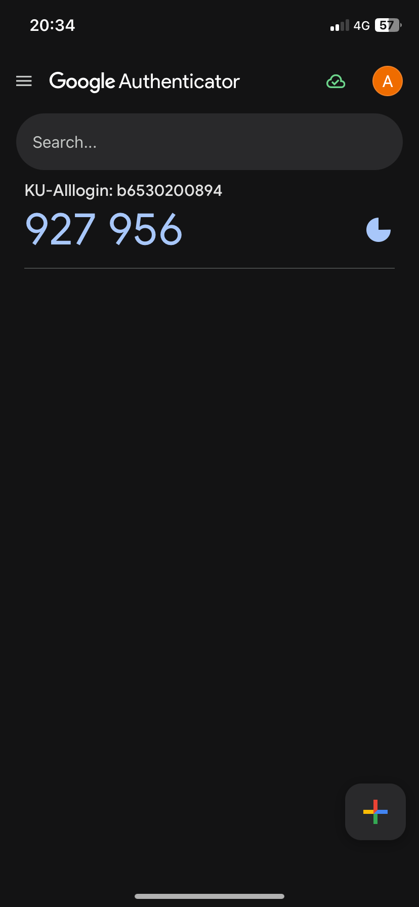

# 🔒 Security Control: Google Authenticator

## 📄 รายละเอียด
Google Authenticator เป็นแอปพลิเคชันที่สร้างรหัส OTP (One-Time Password) เพื่อเพิ่มชั้นความปลอดภัยในการยืนยันตัวตนของผู้ใช้ โดยใช้เป็นส่วนหนึ่งของระบบการยืนยันตัวตนแบบสองขั้นตอน (Two-Factor Authentication - 2FA)

---

### 📋 การจัดประเภท:
- **Control Function:** Preventative  
- **Type of Security Control:** Logical Controls  

---

### 🛡️ เหตุผล:
Google Authenticator ถูกจัดเป็น **Logical Control** เนื่องจากใช้ซอฟต์แวร์และเทคโนโลยีเพื่อยืนยันตัวตนของผู้ใช้งาน และเป็น **Preventative Control** เพราะมีเป้าหมายเพื่อป้องกันการเข้าถึงระบบโดยไม่ได้รับอนุญาตล่วงหน้า ซึ่งช่วยเพิ่มความปลอดภัยของข้อมูลในระบบ

---

### 💡 ตัวอย่างการใช้งาน:
- ใช้รหัส OTP ในการเข้าสู่ระบบบัญชี Google หรือบริการต่าง ๆ เช่น Facebook, GitHub  
- เพิ่มความปลอดภัยให้กับแอปพลิเคชันที่รองรับระบบ 2FA  

